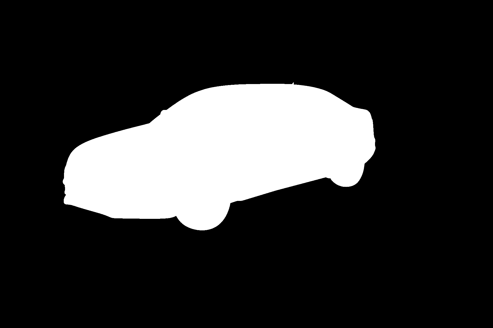
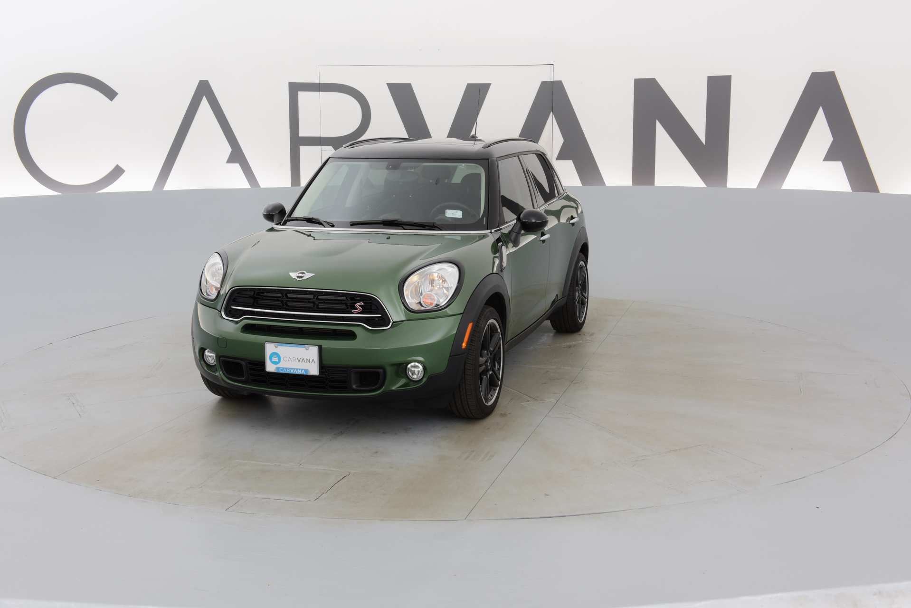
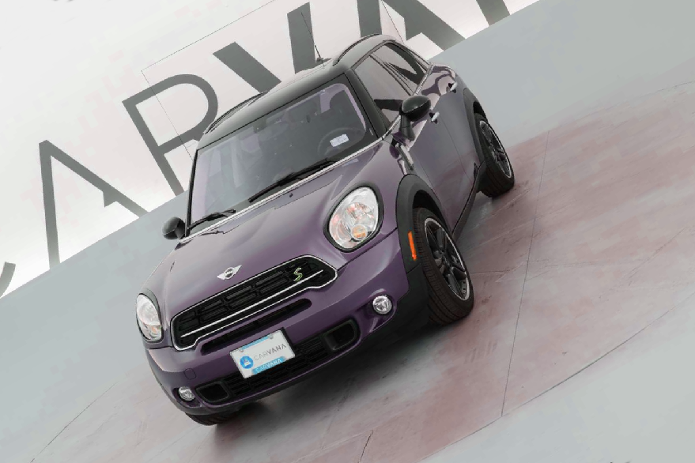
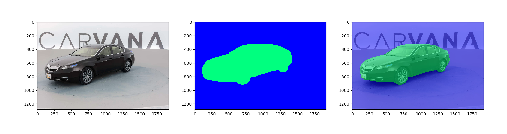

# Semantic Binary Image Segmentation

Image segmentation is a preliminar and essential step in several applicative contexts involving the use of computer vision and image processing techniques.
Recently, Deep Learning algorithm have been used to perform the segmentation of complex images, enabling the automatic detection of regions that correspond to semantically-significant objects in the input image.


## Data

The training set for this project is available on [Kaggle](https://www.kaggle.com/c/carvana-image-masking-challenge/data) and it is provided by [Carvana](https://www.carvana.com/).
It includes 5088 car images, along with a .gif file that contains the manually cutout mask for each image, as shown below.

|
-|-

## Data Augmentation
The project relies on data augmentation to improve the performance of the model.
Input images are transformed using random translations and rotations. Furthermore, random scale and hue shifts are applied, as shown in the following picture.





## Architecture

This project makes use of a [UNet](https://lmb.informatik.uni-freiburg.de/people/ronneber/u-net/)-like deep convolutional neural network, that allows to precisely identify the boundaries of the objects in an image, even when a low number of training examples is available.
The neural network has been implemented using Keras and TensorFlow.
The model has been trained to minimize two different loss functions, based on the following measures:

* Dice Coefficient,
* Binary Cross-entropy.

## Results
The performance of the system has been evaluated using different image sizes.
Clearly, decreasing the size of the input image allows training the model more quickly, but it has a negative impact on the evaluation of the system.

Image size  | Average Dice Coefficient
------------|----------------
128 x 128   | 0.9906
256 x 256   | 0.9924
512 x 512   | 0.9952
1024 x 1024 | 0.9963

The following picture shows a segmentation produced by the system on an image included in the test set.



## Requirements

* Keras 2.0
* TensorFlow
* sklearn
* OpenCV
* Pandas
* h5py

## Usage

* Run ```python train.py``` to train the model.
* Run ```python test.py``` to make predictions on test data.
